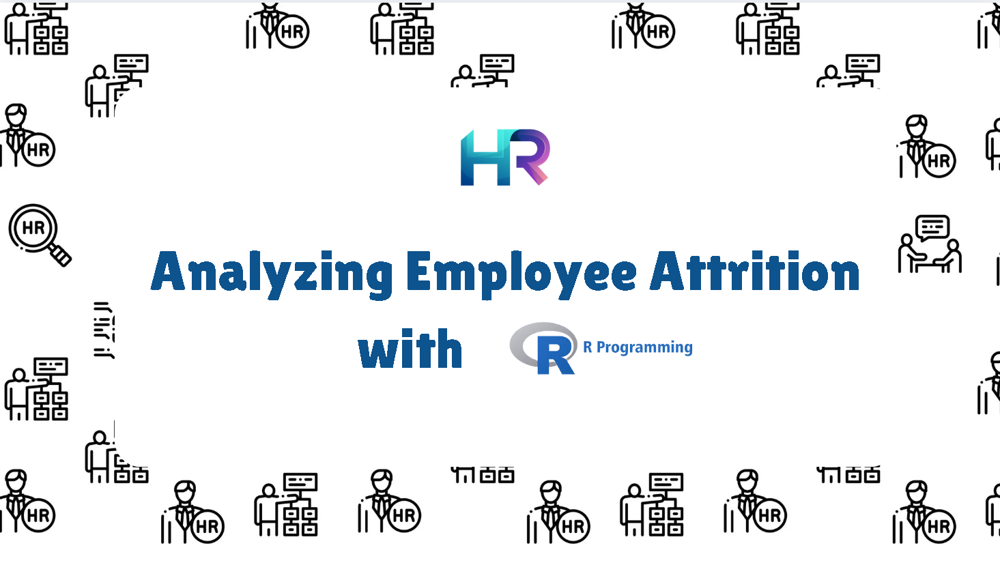
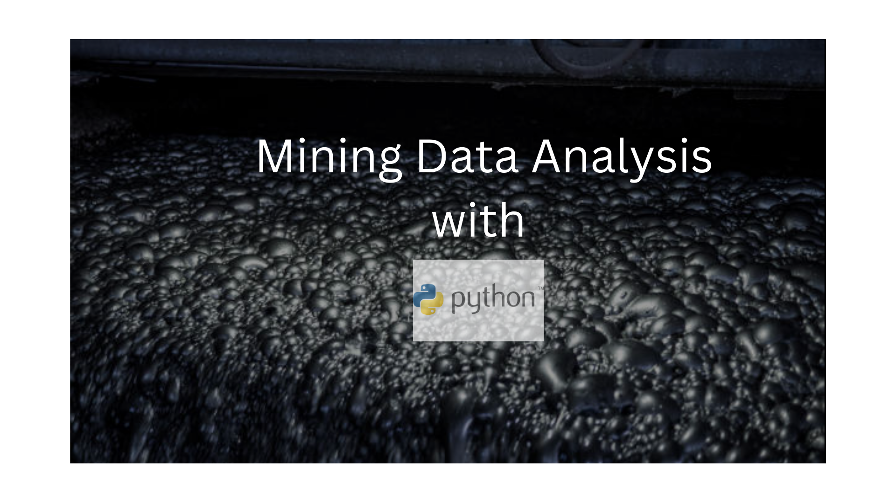
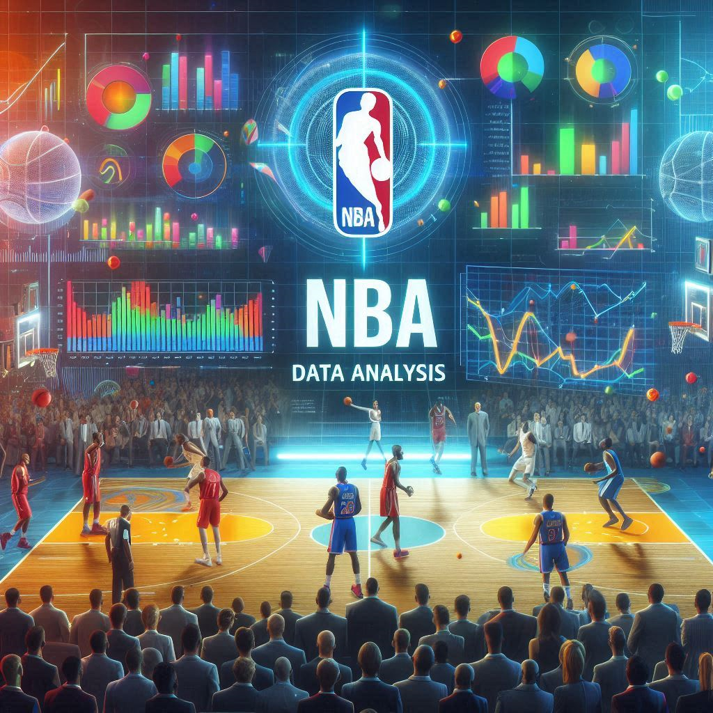

# Welcome to My Portfolio
I am proficient in the following software and I am always curious and willing to learn new skills in these programs. Keep scrolling to see some of my projects where I utilize these programs to analyze data.

---

# [CLICK HERE to read full article](/HR.md)

### I looked over and analyzed some HR department data to see if any statistical trends could explain employee attrition within the company. There were some interesting discoveries within the data. I used R to conduct some stat analysis and create some data visualizations.

# [CLICK HERE to read full article](/mining.md)

### I was tasked to analyze mining data for the boss of a fictitious mining company, Metals R Us. The dataset spanned over a few months but there was one date in question that the boss wanted some information on. I used python for this project to clean and analyze the data provided to me. 

# [CLICK HERE to read full article](/NBA_project.md)

### Putting myself in the shoes of an NBA team manager to analyze season performance. This 2021-2022 NBA dataset had plenty of stats to go through and contemplate decisions to improve my team for next season. I created four insightful data visualizations using Tableau. 

# [CLICK HERE to read full article](/healthcare.md)

### This project analyzes diabetic patient data from 1999-2008. That is 10 years of clinical care data across 130 US hospitals. This was a rich dataset with plenty of data to go through. I was able to analyze it using MySQL to come up with some interesting insights that the hospital management and leadership team could use to help improve operations and improve patient care.

# [CLICK HERE to read full article](/bank.md)

### Investigating IDA loans. Used SQL to discover insightful info from the World Bank's IDA statement of credits and grants for Nov 2022. Discovered countries with the most debt, which ones paid their loans back the most, and the names of some top funded projects. These insights can provide useful info to the World Bank stakeholders on creditworthiness for certain countries.

# [CLICK HERE to read full article](/schools.md)

### Analyzation of Massachusetts high schools and how effective their education is for their students. I used Tableau to create data visualizations and a dashboard to help offer some useful insights to the DOE Superintendent and state officials regarding their schools and their academic performance. Analysis reveals 162,137 students didn't graduate, while 585,791 pursued higher education. Recommendations on enhancing assistance programs, and college collaboration for educational optimization.

# [CLICK HERE to read full article](/doordash.md)

### Analyzed dataset from iFood, a Brazilian equivalent of DoorDash, marketing campaigns and their performances. I used Excel to clean and analyze the data. I used Excel skills such as Pivot Tables, VLOOKUP, XLOOKUP, Pivot Charts, creating various types of charts, conditional formatting, creating and using filters, etc. I love Excel and continue to learn more tips and tricks with it to help provide insightful analysis to stakeholders.

