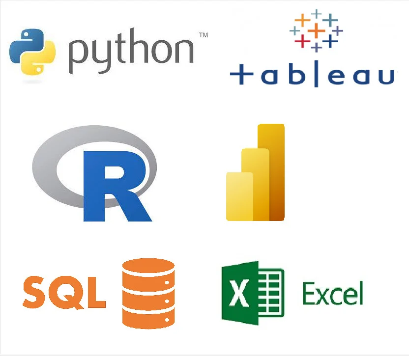

# Welcome to My Portfolio
I am proficient in the following software and I am always curious and willing to learn new skills in these programs. Keep scrolling to see some of my projects where I utilize some of these programs to analyze data.

---
# [CLICK HERE to read full article](/bank.md)

### Investigating IDA loans. Used SQL to discover insightful info from the World Bank's IDA statement of credits and grants for Nov 2022. Discovered countries with the most debt, which ones paid their loans back the most, and the names of some top funded projects. These insights can provide useful info to the World Bank stakeholders on creditworthiness for certain countries.

# [CLICK HERE to read full article](/schools.md)

### Analyzation of Massachusetts high schools and how effective their education is for their students. I used Tableau to create data visualizations and a dashboard to help offer some useful insights to the DOE Superintendent and state officials regarding their schools and their academic performance. Analysis reveals 162,137 students didn't graduate, while 585,791 pursued higher education. Recommendations on enhancing assistance programs, and college collaboration for educational optimization.

# [CLICK HERE to read full article](/doordash.md)

### Analyzed dataset from iFood, a Brazilian equivalent of DoorDash, marketing campaigns and their performances. I used Excel to clean and analyze the data. I used Excel skills such as Pivot Tables, VLOOKUP, XLOOKUP, Pivot Charts, creating various types of charts, conditional formatting, creating and using filters, etc. I love Excel and continue to learn more tips and tricks with it to help provide insightful analysis to stakeholders.

